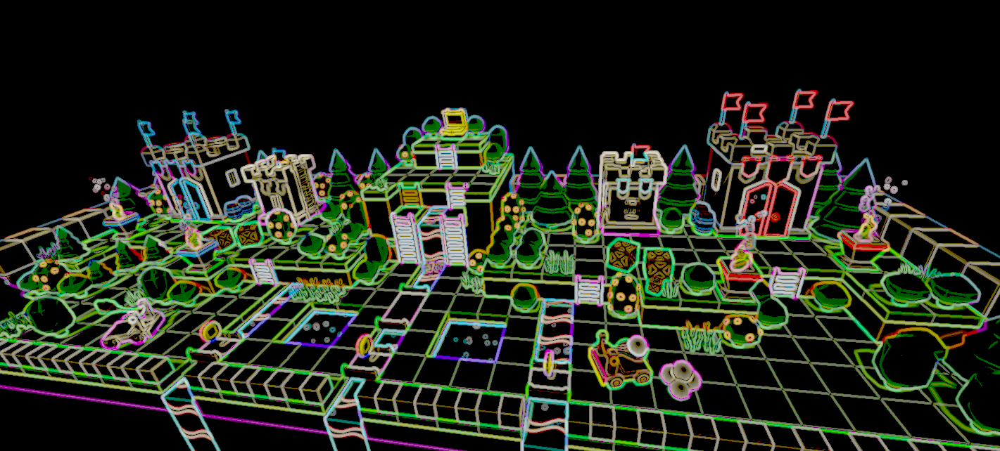

# Unity - Edge detection

3 edge detection algorithms based on color, depth, normal.
Adding a last one based on color and depth with bloom effect.

# Edge detection on forest scene

Default image

1. Color

2. Depth

3. Normal

4. Color + depth + bloom

# Edge detection on unity scene

Default image

1. Color

2. Depth

3. Normal

4. Color + depth + bloom

